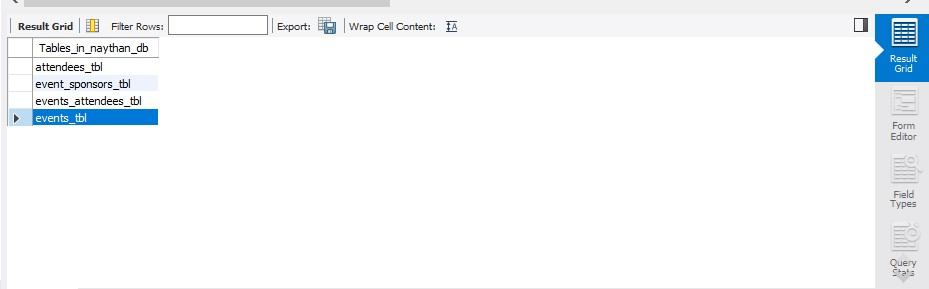
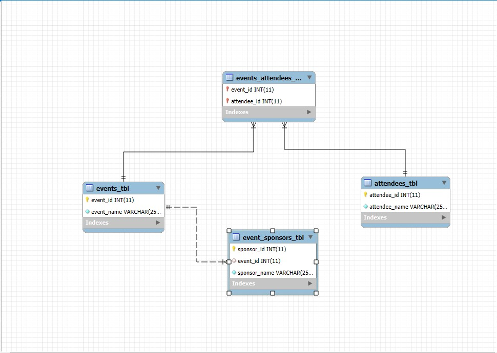

# Finals Lab Task 1 - Events Management Database (Naythan_DB)

### Step 1: Database Structure

The database consists of the following tables:

```sql
-- 1. Events Table
CREATE TABLE events_tbl (
    event_id INT AUTO_INCREMENT PRIMARY KEY,
    event_name VARCHAR(255) NOT NULL
);

-- 2. Attendees Table
CREATE TABLE attendees_tbl (
    attendee_id INT AUTO_INCREMENT PRIMARY KEY,
    attendee_name VARCHAR(255) NOT NULL
);

-- 3. Events-Attendees Junction Table (Many-to-Many)
CREATE TABLE events_attendees_tbl (
    event_id INT,
    attendee_id INT,
    PRIMARY KEY (event_id, attendee_id),
    FOREIGN KEY (event_id) REFERENCES events_tbl(event_id) ON DELETE CASCADE,
    FOREIGN KEY (attendee_id) REFERENCES attendees_tbl(attendee_id) ON DELETE CASCADE
);

-- 4. Event Sponsors Table
CREATE TABLE event_sponsors_tbl (
    sponsor_id INT AUTO_INCREMENT PRIMARY KEY,
    event_id INT,
    sponsor_name VARCHAR(255) NOT NULL,
    FOREIGN KEY (event_id) REFERENCES events_tbl(event_id) ON DELETE CASCADE
);
```

### 📸 Step 2: Table Output



### 📐 Step 3: Entity Relationship Diagram (ERD)



## Database Creation SQL Script

```sql
CREATE DATABASE IF NOT EXISTS Naythan_DB;
USE Naythan_DB;

CREATE TABLE IF NOT EXISTS events_tbl (
  event_id INT AUTO_INCREMENT PRIMARY KEY,
  event_name VARCHAR(255) NOT NULL
);

CREATE TABLE IF NOT EXISTS attendees_tbl (
  attendee_id INT AUTO_INCREMENT PRIMARY KEY,
  attendee_name VARCHAR(255) NOT NULL
);

CREATE TABLE IF NOT EXISTS events_attendees_tbl (
  event_id INT,
  attendee_id INT,
  PRIMARY KEY (event_id, attendee_id),
  FOREIGN KEY (event_id) REFERENCES events_tbl(event_id),
  FOREIGN KEY (attendee_id) REFERENCES attendees_tbl(attendee_id)
);

CREATE TABLE IF NOT EXISTS event_sponsors_tbl (
  event_id INT,
  sponsor_name VARCHAR(255) NOT NULL,
  PRIMARY KEY (event_id, sponsor_name),
  FOREIGN KEY (event_id) REFERENCES events_tbl(event_id)
);
```

## 📄 Task 4 – SQL File Download

The following raw files are available for download:

- [SQL Script](https://github.com/NaythanIsME/EDM-Portfolio/blob/main/Finals%20Task%201/Files/naytheen.sql) - The SQL script to create the database and tables.
- [ERD File](https://github.com/NaythanIsME/EDM-Portfolio/blob/main/Finals%20Task%201/Files/naythan.mwb) - The raw ERD file for visual representation of the database.
